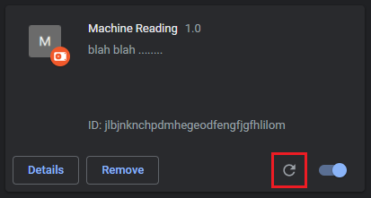

# Helper Machine Reading Extension

A web extension for Chrome which provides a question answering tool for user to read

## Features

### Get input 
<!-- (***change this after upgrade) -->

Add your question in the text box and press <kbd>enter</kbd>

### Download the data
<!-- (***change this after upgrade) -->

After press <kbd>enter</kbd>, the extension return result that is whole of the article

## Installation

### Chrome/Brave

- [Install from the Chrome Web Store]() coming soon

#### GitHub Enterprise

- coming soon

## Development

If you want to install it manually. First clone or fork the repo. Then, access your [Chrome Extensions page](chrome://extensions/), make sure "Developer mode" is checked. You can then click the `Load unpacked` button and browse to the "src" directory of this repo.

Once you've made changes to the extension, go back to the Extensions page and click the Reload link under the extension entry.

## License

This project is licensed under [SEPM-Team24 License]()